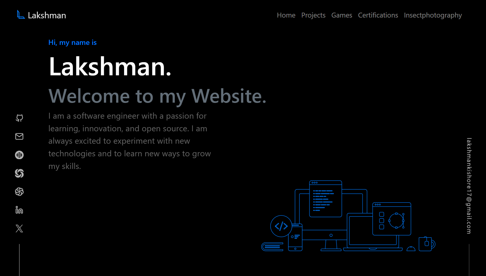

# Lakshman's Portfolio Website

Hello there! 👋 Thanks for exploring the repository for my latest portfolio website. This site is not just a showcase of my work but a personal project that reflects my growth as a developer over the past years. I've poured my heart into creating something that highlights what I've learned and accomplished.

## About the Project

The design and functionality of this portfolio are crafted with passion and precision. Inspired by continuous learning and innovation, this project embodies my commitment to staying on the cutting edge of technology.

## Tools and Technologies

- **Developed with ❤️ using React**: Leveraging the power of React to build a dynamic and responsive user interface.
- **Styled with React Bootstrap**: Employing the flexibility and aesthetics of React Bootstrap for a polished design.
- **Icons powered by Iconify**: Enhancing visual appeal with a collection of expressive icons.
- **Version controlled with Git and hosted on GitHub**: Ensuring efficient collaboration and code management.
- **Deployed seamlessly with Vercel**: Achieving a smooth and reliable deployment process.

## Design Inspiration

The design of this website draws inspiration from [Brittany Chiang's Portfolio](https://v4.brittanychiang.com/). After numerous iterations and exploration of various portfolio designs, I stumbled upon Brittany's work, which resonated with my vision. This inspiration fueled the creation of a portfolio that truly reflects my style and showcases my skills.

Feel free to explore the code and let me know your thoughts! Contributions and feedback are always welcome.

Happy coding! 🚀

